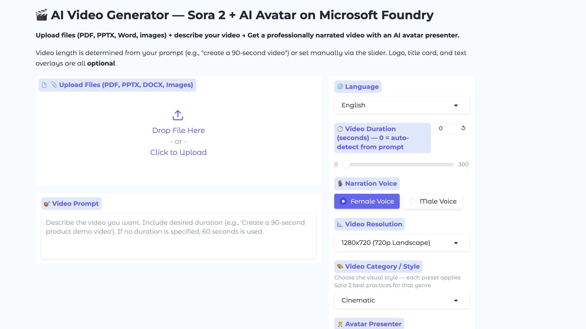
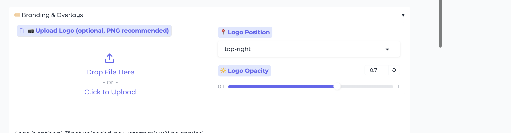
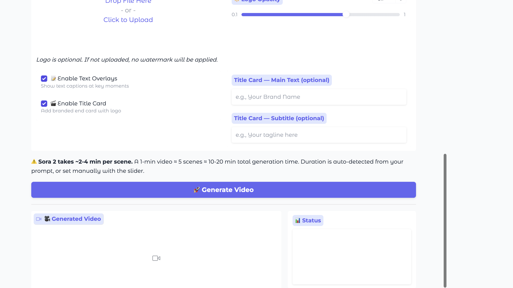

# 🎬 AI Video Generator — Sora 2 + AI Avatar on Microsoft Foundry

An end-to-end AI video generation pipeline that transforms documents, images, and text prompts into professionally narrated videos with an AI avatar presenter. Built with LangChain, Azure AI Foundry, Sora 2, and Azure Speech Services.

> Upload a PDF / PPTX / DOCX (or just type a prompt) → get a fully edited, narrated MP4 with an AI avatar that opens and closes the video, cinematic Sora 2 B-roll, multi-language voiceover, optional logo watermark, title card, and on-screen captions.

---

## 📸 Screenshots

### Main interface — upload, prompt, and creative controls


### Branding & overlays — logo watermark, title card, captions


### One-click generation + branded title card and video output


---

## ✨ Features

| Feature | Description |
|---------|-------------|
| **🎯 Prompt-Driven Duration** | Video length auto-detected from your prompt (e.g., "create a 90-second video") or set manually |
| **🧑‍💼 AI Avatar Presenter** | Multi-point avatar (intro, mid-video bridge, outro) via Azure Speech Avatar API |
| **🎬 Sora 2 Video Generation** | Cinematic AI-generated video clips via Microsoft Foundry |
| **🌐 Multi-Language** | English, Hindi, Telugu, Kannada, Tamil |
| **📎 Document Intelligence** | Upload PDF, PPTX, DOCX, images to auto-generate video content |
| **🏷️ Optional Logo Watermark** | Upload your logo or skip it entirely |
| **🎬 Optional Title Card** | End card with custom title/subtitle — fully optional |
| **📝 Optional Text Overlays** | On-screen captions at key moments |
| **🎙️ Male/Female Voices** | Multiple Azure Neural Voices per language |
| **🧑‍💼 20+ Avatars** | Full-body and talking-head avatar characters |

---

## 🏗️ Architecture

```
┌─────────────────────────────────────────────────────────────────┐
│                        Gradio UI (app.py)                        │
└─────────────────────┬───────────────────────────────────────────┘
                      │
        ┌─────────────┼─────────────────────────────┐
        ▼             ▼                             ▼
┌──────────────┐ ┌──────────────┐         ┌──────────────────┐
│  Content     │ │  LLM Backend │         │  Avatar Engine   │
│  Extractor   │ │  (GPT Script)│         │  (Azure Speech)  │
└──────┬───────┘ └──────┬───────┘         └────────┬─────────┘
       │                │                          │
       ▼                ▼                          ▼
┌──────────────┐ ┌──────────────┐         ┌──────────────────┐
│  PDF/PPTX/   │ │  Video Engine│         │  TTS Engine      │
│  DOCX/Images │ │  (Sora 2)   │         │  (Azure Speech)  │
└──────────────┘ └──────┬───────┘         └────────┬─────────┘
                        │                          │
                        ▼                          ▼
                ┌─────────────────────────────────────────┐
                │        Video Assembler (MoviePy)         │
                │  + Overlay Engine (logo, text, titles)   │
                └─────────────────────────────────────────┘
                                  │
                                  ▼
                          📹 Final Video (MP4)
```

### Pipeline Steps

1. **Extract Content** — Parse uploaded files (PDF, PPTX, DOCX, images) into text and image data
2. **Generate Script** — GPT creates a structured video script with scenes, narration, and visual descriptions
3. **Generate Avatar** — Azure Speech Avatar creates intro, mid-video bridge, and outro segments
4. **Generate Video Clips** — Sora 2 generates cinematic video clips for each scene
5. **Generate Narration** — Azure TTS creates voiceover audio in the selected language
6. **Assemble Video** — MoviePy concatenates everything with optional overlays, watermark, and title card

### 🔊 Audio & lip-sync design (why it sounds right)

The assembler binds **each clip's audio to that clip *before* concatenation**, instead of mixing every voice onto one global timeline. This guarantees two things that are easy to get wrong:

- **Exactly one voice at any moment** — the avatar's own muxed audio plays over the avatar segments, and only the matching per-scene narration plays over the Sora 2 content. No bleed/overlap.
- **Frame-locked lip sync** — the avatar's audio is never repositioned relative to its frames, so the presenter's lips always match the voice.

This behaviour is enforced by an automated end-to-end check (`_e2e_verify.py`) that generates a real video and verifies: (1) one voice at a time, (2) avatar voice matches the lip-synced source, (3) the avatar opens **and** closes the video.

---

## 🔧 Setup

### Prerequisites

- Python 3.12+
- `ffmpeg` installed on your system
- Azure AI Foundry project with:
  - GPT model deployment (e.g., GPT-4o, GPT-5.2)
  - Sora 2 video model deployment
  - Azure Speech Services (TTS + Avatar)
- Azure CLI authenticated (`az login`)

### 1. Install System Dependencies

```bash
# macOS
brew install ffmpeg

# Ubuntu/Debian
sudo apt install ffmpeg

# Windows (with chocolatey)
choco install ffmpeg
```

### 2. Install Python Dependencies

```bash
# Create virtual environment
python3 -m venv .venv
source .venv/bin/activate

# Install packages
pip install -r requirements.txt
```

### 3. Configure Environment Variables

Copy the template and fill in your own credentials:

```bash
cp .env.example .env
```

Then edit `.env`:

```env
# Microsoft Foundry — GPT model (script generation)
AZURE_AI_PROJECT_ENDPOINT=https://<your-resource>.services.ai.azure.com/api/projects/<your-project>
AZURE_AI_API_KEY=<your-azure-ai-api-key>
MODEL_DEPLOYMENT_NAME=gpt-5.2

# Sora 2 — Video Generation (OpenAI v1 API surface on Azure)
AZURE_VIDEO_ENDPOINT=https://<your-resource>.openai.azure.com/openai/v1/
SORA_MODEL=sora-2

# Azure Speech Services (TTS + Avatar)
AZURE_SPEECH_ENDPOINT=https://<your-resource>.cognitiveservices.azure.com/
AZURE_SPEECH_KEY=<your-azure-speech-key>
AZURE_SPEECH_REGION=swedencentral
```

> ⚠️ **Never commit your `.env`.** It is already listed in `.gitignore`. If a key has ever been shared or pushed, rotate it in the Azure portal.

### 4. Run

```bash
python app.py
# Open http://127.0.0.1:7860
```

---

## 🚀 Usage

### Quick Start

1. **(Optional)** Upload source files — PDFs, presentations, documents, or images
2. **Write your prompt** — Describe the video you want, including desired duration:
   - `"Create a 60-second product demo video from the uploaded presentation"`
   - `"Make a 2-minute explainer video about cloud computing"`
   - `"Generate a 30-second social media teaser from my report"`
3. **(Optional)** Adjust settings — language, voice, avatar, logo, title card
4. Click **Generate Video** and wait for the pipeline to complete

### Duration Auto-Detection

The system automatically parses duration from your prompt:

| Prompt Pattern | Detected Duration |
|---------------|-------------------|
| `"60-second video"` | 60s |
| `"2-minute explainer"` | 120s |
| `"90s teaser"` | 90s |
| `"Create a 30 sec clip"` | 30s |
| No duration mentioned | 60s (default) |
| Slider set to a value > 0 | Slider value overrides |

### Optional Features

| Feature | How to Enable | Default |
|---------|--------------|---------|
| Logo Watermark | Upload a logo file (PNG/JPG) | Off — no logo |
| Title Card | Check "Enable Title Card" + optionally add text | Off |
| Text Overlays | Check "Enable Text Overlays" | On |
| Avatar Presenter | Always included | On |

---

## 📁 File Structure

```
langchain-video-gen-version1/
├── app.py                 → Gradio UI and main pipeline orchestrator
├── llm_backend.py         → GPT script generation (LangChain + Azure AI)
├── video_engine.py        → Sora 2 video clip generation
├── avatar_engine.py       → Azure Speech Avatar (intro/mid/outro)
├── tts_engine.py          → Azure TTS narration (multi-language)
├── video_assembler.py     → Final video assembly (MoviePy, per-clip audio)
├── overlay_engine.py      → Logo watermark, text overlays, title card
├── content_extractor.py   → Document/image content extraction
├── video_styles.py        → Sora 2 category/style presets
├── _test_all.py           → Unit tests (mocked, fast)
├── _e2e_verify.py         → Real end-to-end verification (one-voice/lip-sync)
├── requirements.txt       → Python dependencies
├── .env.example           → Environment variable template
├── .gitignore             → Excludes secrets, venvs, generated media
├── assets/                → Runtime assets + docs screenshots
│   └── screenshots/       → GUI screenshots used in this README
├── prompts/               → Example prompts
└── README.md              → This file
```

---

## 🌐 Supported Languages & Voices

| Language | TTS Voice (Female) | TTS Voice (Male) |
|----------|-------------------|-------------------|
| English | en-IN-NeerjaNeural | en-IN-PrabhatNeural |
| Hindi | hi-IN-SwaraNeural | hi-IN-MadhurNeural |
| Telugu | te-IN-ShrutiNeural | te-IN-MohanNeural |
| Kannada | kn-IN-SapnaNeural | kn-IN-GaganNeural |
| Tamil | ta-IN-PallaviNeural | ta-IN-ValluvarNeural |

---

## 📎 Supported Input Formats

- **Documents**: PDF, DOCX, DOC, PPTX, PPT, TXT, MD
- **Images**: PNG, JPG, JPEG, GIF, WEBP, BMP

---

## 💡 Example Prompts

```
Create a 60-second professional product showcase video with cinematic B-roll and avatar presenter

Generate a 90-second explainer video from the uploaded presentation with smooth transitions

Make a 2-minute training video that walks through the process described in the uploaded document

Create a 30-second social media teaser summarizing the key points from my report

Build a 45-second company culture video with upbeat visuals and an energetic narrator
```

---

## 🛠️ SDK & Libraries Used

| Purpose | Class/SDK | Package |
|---------|-----------|---------|
| Script generation (LLM) | `AzureAIOpenAIApiChatModel` | `langchain-azure-ai` |
| Image analysis (Vision) | `AzureAIOpenAIApiChatModel` | `langchain-azure-ai` |
| Document loading | `PyPDFLoader`, `Docx2txtLoader`, etc. | `langchain-community` |
| Text splitting | `RecursiveCharacterTextSplitter` | `langchain-text-splitters` |
| Video generation | OpenAI Python SDK (Sora 2) | `openai` |
| Narration (TTS) | Azure Speech SDK | `azure-cognitiveservices-speech` |
| Avatar (Speech Avatar) | Azure Cognitive Services REST API | `requests` |
| Video assembly | `moviepy` | `moviepy` |
| Auth | `DefaultAzureCredential` | `azure-identity` |

---

## ⚠️ Notes & Limitations

- **Generation time**: Each Sora 2 clip takes ~2-4 minutes. A 1-minute video (≈5 scenes) takes 10-20 minutes total.
- **Duration accuracy**: Target duration is approximate. Actual video depends on generated clip lengths.
- **Sora 2 resolution**: Only 1280x720 (720p landscape) is supported.
- **Sora 2 clip lengths**: 4, 8, or 12 seconds per clip (12s preferred for efficiency).
- **Avatar availability**: Requires Azure Speech Avatar API access in your region.
- **Logo**: Fully optional — no default logo is applied if you don't upload one.
- **Title card**: Only generated if explicitly enabled and text is provided.

---

## 🧪 Testing

Unit tests (fast, no cloud calls — mocked):

```bash
python _test_all.py
```

Real end-to-end verification (generates an actual video and validates one-voice, lip-sync, and avatar open/close):

```bash
python _e2e_verify.py
```

---

## 📄 License

MIT
